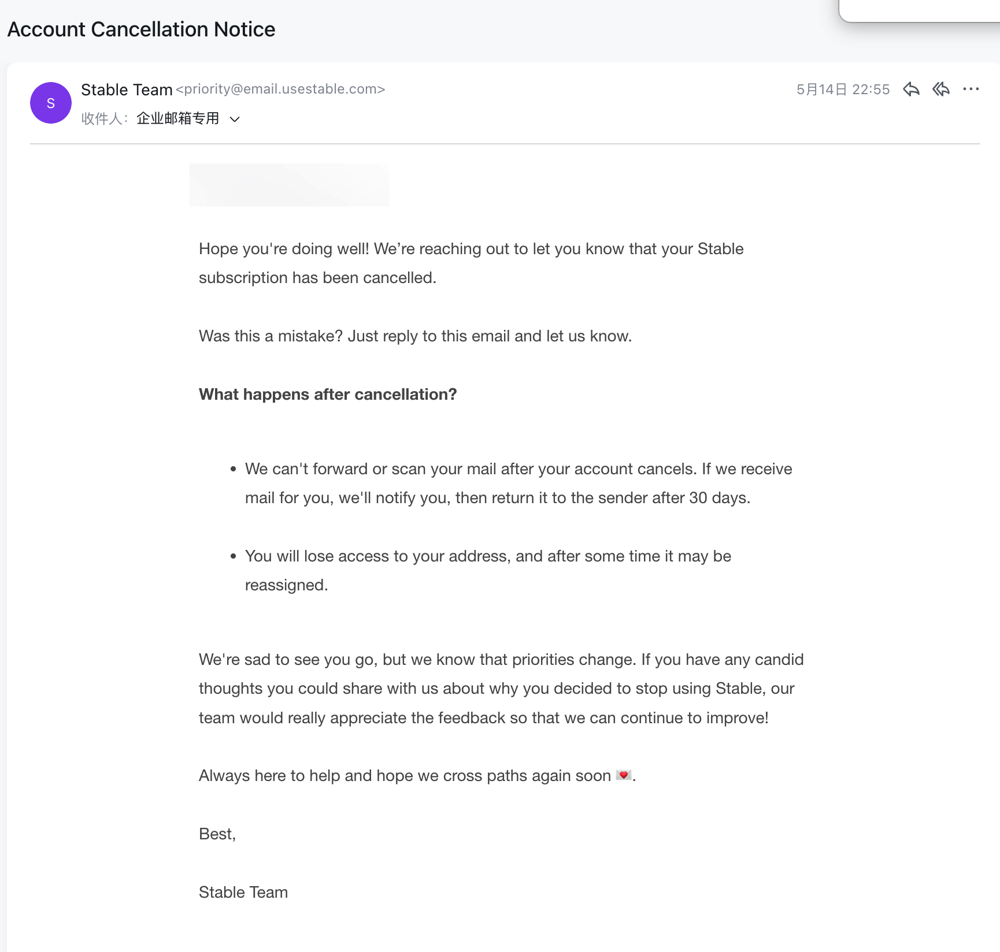
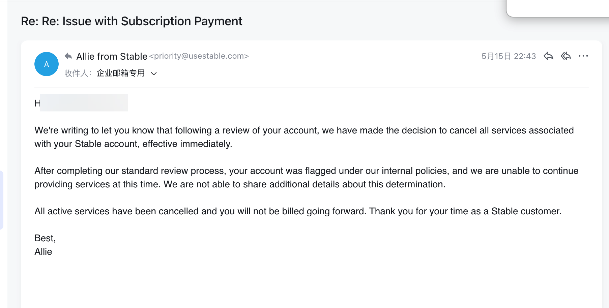
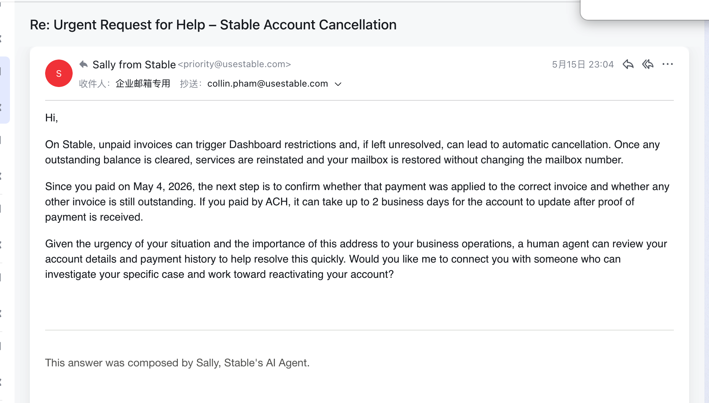
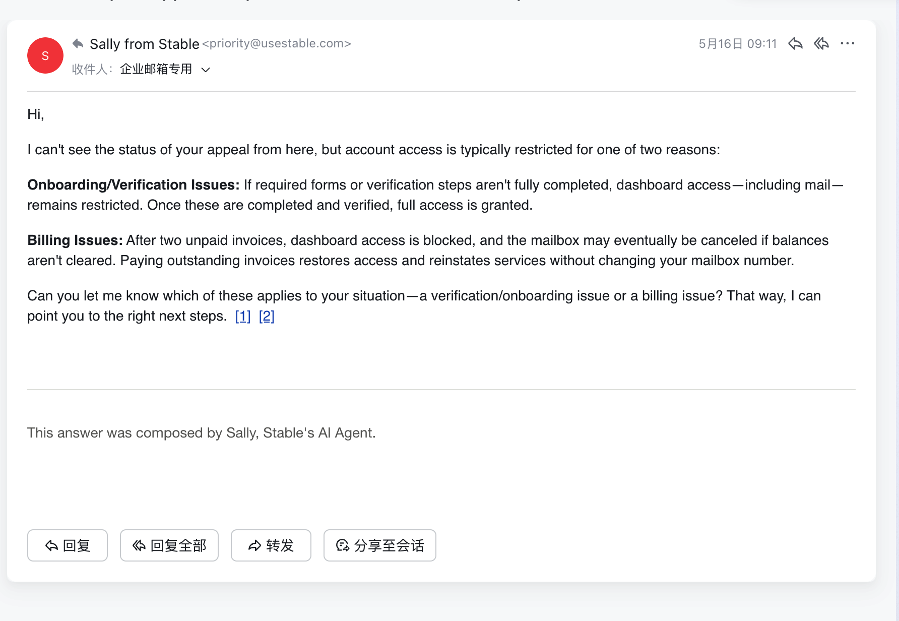
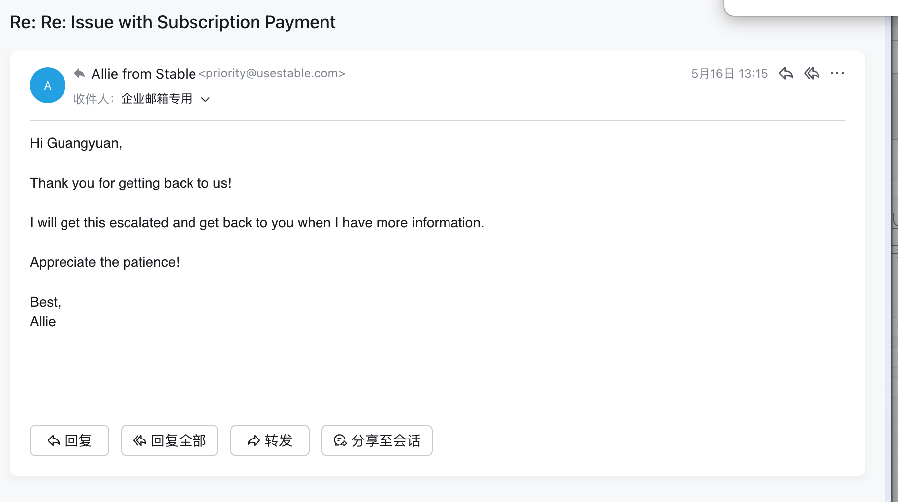
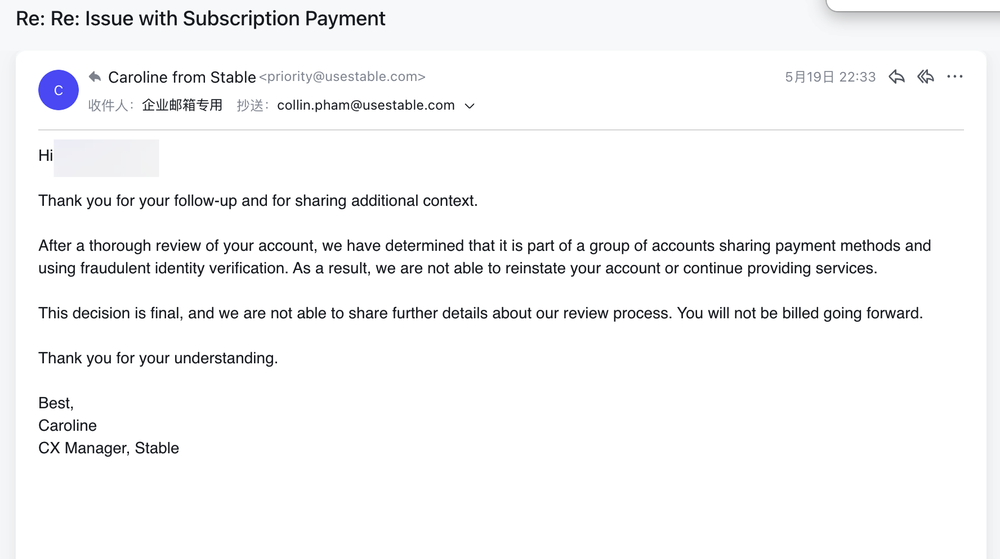
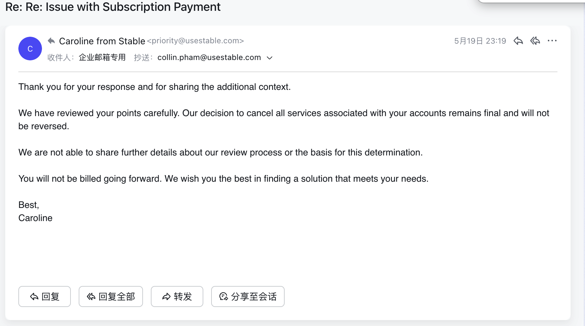
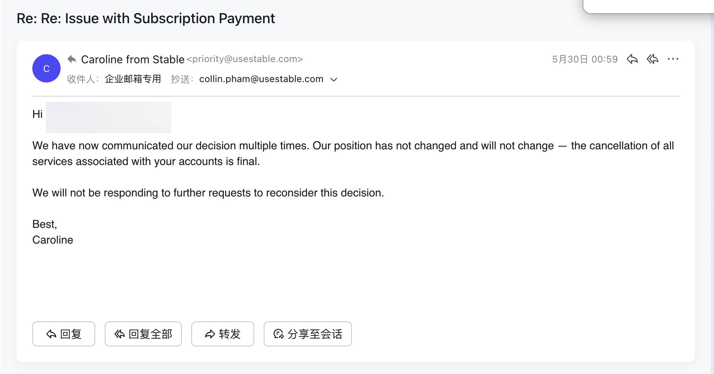
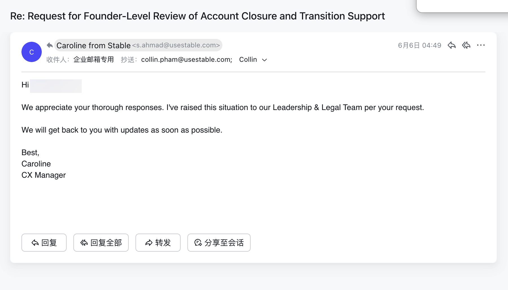
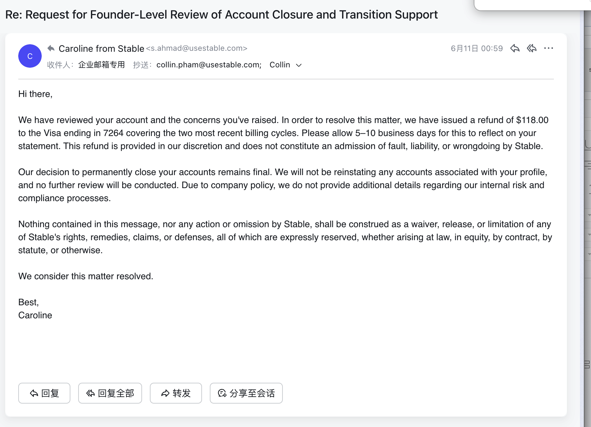

# Stable (www.usestable.com) Account Shutdown: A Refund Does Not Replace a Transition Period

> This article documents my experience when my Stable / useStable / www.usestable.com account was closed or refused restoration. It focuses on the helplessness of losing access to a business address and mail channel while operating from outside the United States.

When I received the Stable account termination notice, my first reaction was not anger. It was shock.

This was not an ordinary website login. Behind the Stable account were my company address, IRS records, banks, payment platforms, customer information, vendors, and physical mail that had already been sent.

For someone outside the United States, a U.S. virtual business address is not just a field on a webpage. It is the line connecting the company to the outside world.

Suddenly, Stable was telling me that line might be cut.

## The Closure Notice

I contacted Stable / useStable, explained the payment situation, explained the business background, and explained why the account could not simply be closed without a transition period.

The replies were slow. Sometimes a day passed with no real answer. Sometimes the response felt like a template or an AI-generated message. My company mail access was at risk, but inside Stable it felt like just another support ticket.

Eventually, a real person appeared in the conversation. But even then, I did not know whether anyone had the power or willingness to solve the actual problem.

## I Explained the Business Context

Stable mentioned risk factors such as shared payment methods, multiple accounts, identity information, and payment failures. From a platform’s perspective, those labels may look clean. From my perspective, each label had a real-world explanation.

We had multiple U.S. companies and different business experiments. Some projects were tested for a few weeks or a month and then stopped if they had no revenue. Different business emails were used because they represented different companies or product lines, not because we were trying to hide anything.

As a non-U.S. founder, I also have limited payment cards, and cross-border card payments can be blocked by banks. What Stable saw as “shared payment method” or “multiple accounts,” I saw as a small team trying to operate in the real world.

I also explained the identity history: the account had earlier involvement from a partner, I later took over, Stable support helped update my passport and selfie-with-passport information, and the two-passport issue was connected to the earlier passport destruction problem.

## Waiting Without Power

After several rounds of communication, Stable still refused to restore the account.

I told Stable that if the issue was not handled, I would prepare arbitration. Stable replied that it would investigate or involve the legal team.

Then I waited.

One day passed. No real result. Two days passed. Three, four, five days passed. Still nothing meaningful. We waited like people standing outside a closed office door, not knowing whether anyone inside was actually working on the problem.

Only when I followed up again did something move.

During that waiting period, I was not waiting for a normal support answer. I was waiting to know whether my company could still receive mail, whether documents already in transit would be lost, and whether bank or government letters would still have somewhere to go.

Finally, after I pushed again, Stable processed a refund.

But the refund did not solve the problem. It only solved the bill.

## Why a Refund Is Not Enough

If this were just a software subscription, a refund might end the matter. But Stable is a virtual address and virtual mailbox provider.

A refund cannot notify the IRS. It cannot notify banks. It cannot catch mail already in transit. It cannot explain to customers why an address suddenly changed. It cannot recover future documents sent to the old Stable address.

What I needed was simple: an explanation, time, and a plan for future mail. Even if Stable did not want to continue serving me, I needed a transition period. I needed time to move the address, notify banks and tax agencies, and pay for forwarding of mail already received or in transit.

Instead, the feeling was: the account is closed, the money is refunded, please leave.

That helplessness is the real issue. Stable had the system, the address, and the mail channel. I was overseas, separated by time zones, distance, language, and platform rules. I could only write emails and wait.

## What a Responsible Virtual Address Provider Should Do

Stable can run risk reviews. Stable can refuse continued service. But when there is no immediate emergency, a virtual address provider should give users a migration path.

At minimum, Stable / useStable / www.usestable.com should explain the closure reason, respond to the user’s evidence, provide a transition period, offer paid forwarding for mail already received or in transit, and allow the user to download account records.

Without that, the power imbalance is severe: Stable can close the account with one decision, while the user carries every consequence.

