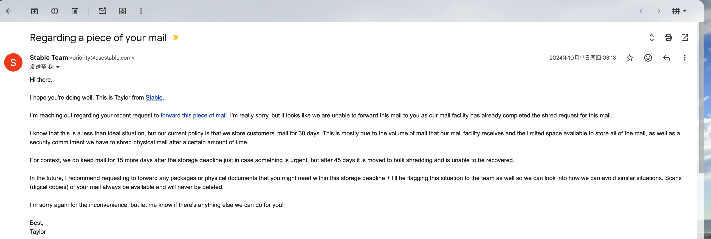
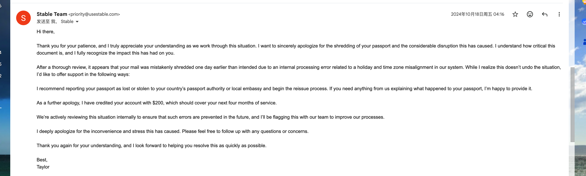

# Passport Destroyed by Stable (www.usestable.com): Identity Documents Should Not Be Handled This Way

> This is part of my public record about Stable / useStable / www.usestable.com. It describes my personal experience with Stable virtual address service and identity document handling. This is my account based on the records I have.

For a cross-border founder, a passport is not just a piece of paper. It is tied to identity verification, banking, Stripe, PayPal, business compliance, payment platforms, and virtual address verification.

When a passport is sent to a U.S. remote address service such as Stable / useStable / www.usestable.com, the service provider should handle it with extreme care, clear tracking, and a transparent process.

In my experience with Stable, one of the most serious issues was the handling and destruction of my passport.

## What Happened

I sent my passport to the United States for a Stable virtual address / verification process. Based on my prior communication with Stable, I understood that my passport would be kept at their receiving location and that the holding period would be extended to 45 days.

That gave me the understanding that I still had time to arrange retrieval, forwarding, or further communication.

Instead, the passport was destroyed before the extended period I understood. My understanding was that Stable agreed to extend the storage to 45 days, but in practice it appeared that once 30 days passed, the passport was destroyed.

Even if Stable later apologized or offered membership credit, the original passport was already gone. No apology could restore it.

This was not like losing a small item. I had to obtain a new passport. My old passport had already been used with Stripe, PayPal, bank accounts, my Stable account, and other business services. Once the passport number changed, I had to explain why I had two passports, why the identity document changed, and why later verification records did not match earlier records.

## Evidence Screenshots

## Why It Matters

Stable virtual address service is not a simple package pickup counter. Users send identity documents, bank mail, IRS letters, and company records because they trust Stable / useStable / www.usestable.com to handle those documents responsibly.

For a passport, Stable should have been able to explain:

- when the passport was received;
- how long it would be stored;
- when and why it would be destroyed;
- whether a clear pre-destruction notice was sent;
- whether the user could pay for forwarding or another handling option.

If Stable believes it followed its rules, it should identify the exact rule, notice, date, and processing record.

## The Chain Reaction

The passport issue later became part of a broader identity problem. Stable risk review questioned identity-related matters, and I had to explain why my passport changed, why there were two passport records, and why the account history involved previous identity updates.

The real damage is that a passport lives across many systems. It is not contained inside Stable. Once the original passport was destroyed, I had to deal with banks, payment platforms, business tools, and manual reviews elsewhere.

## What I Want Stable to Explain

I want Stable / useStable / www.usestable.com to explain why the passport was destroyed despite my understanding that the holding period had been extended to 45 days, whether a clear notice was sent, and whether the incident affected later risk review decisions.

I also want Stable to explain what real remedy exists beyond an apology or membership credit, because the identity document damage did not end inside the Stable platform.

