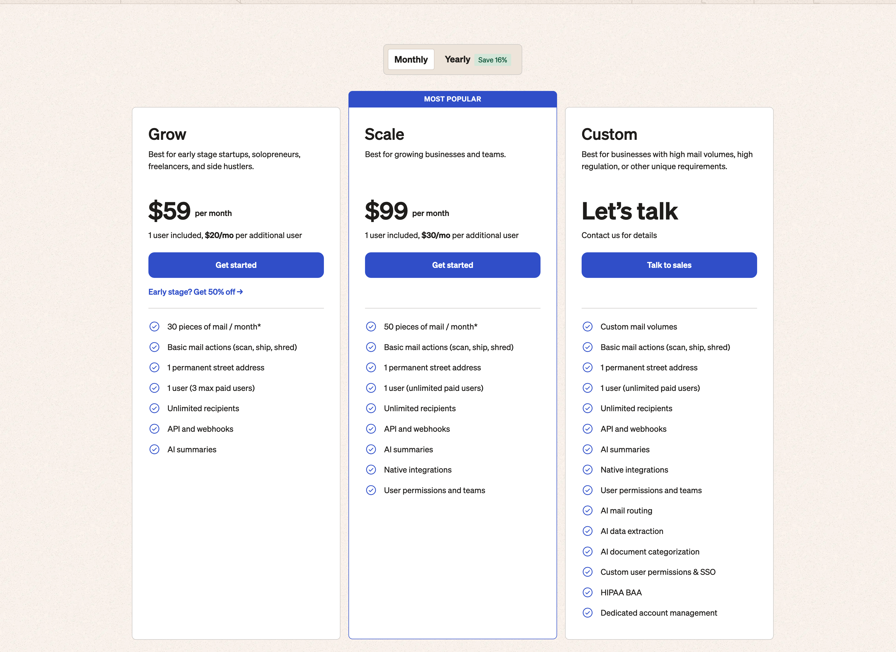
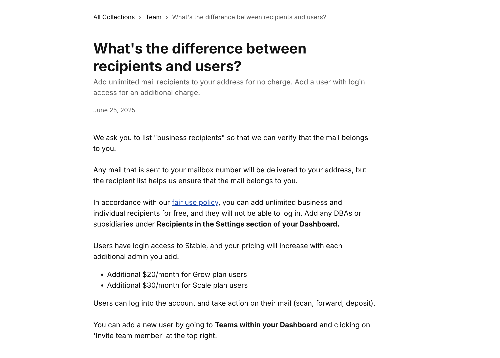
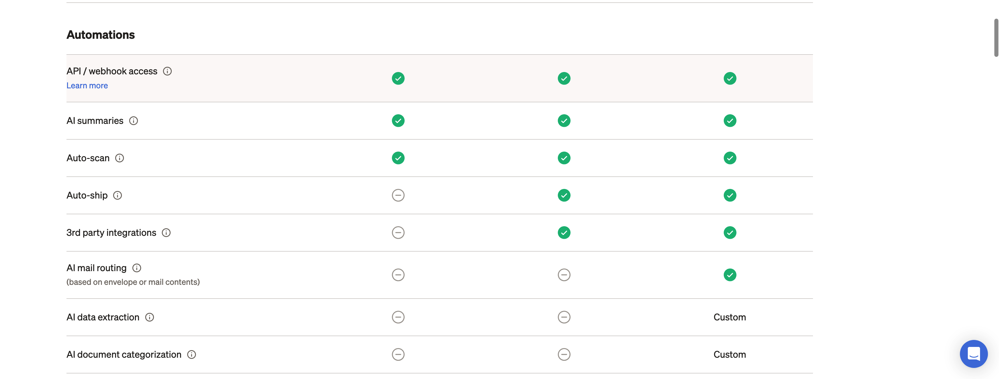
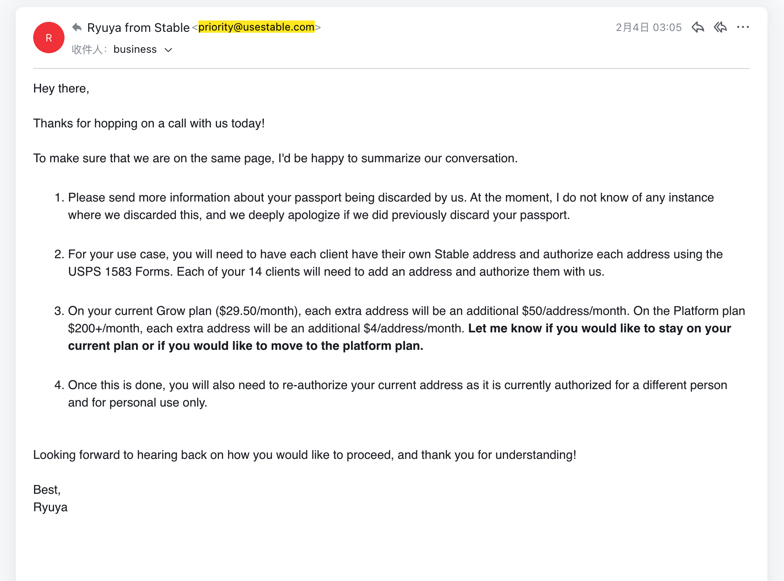
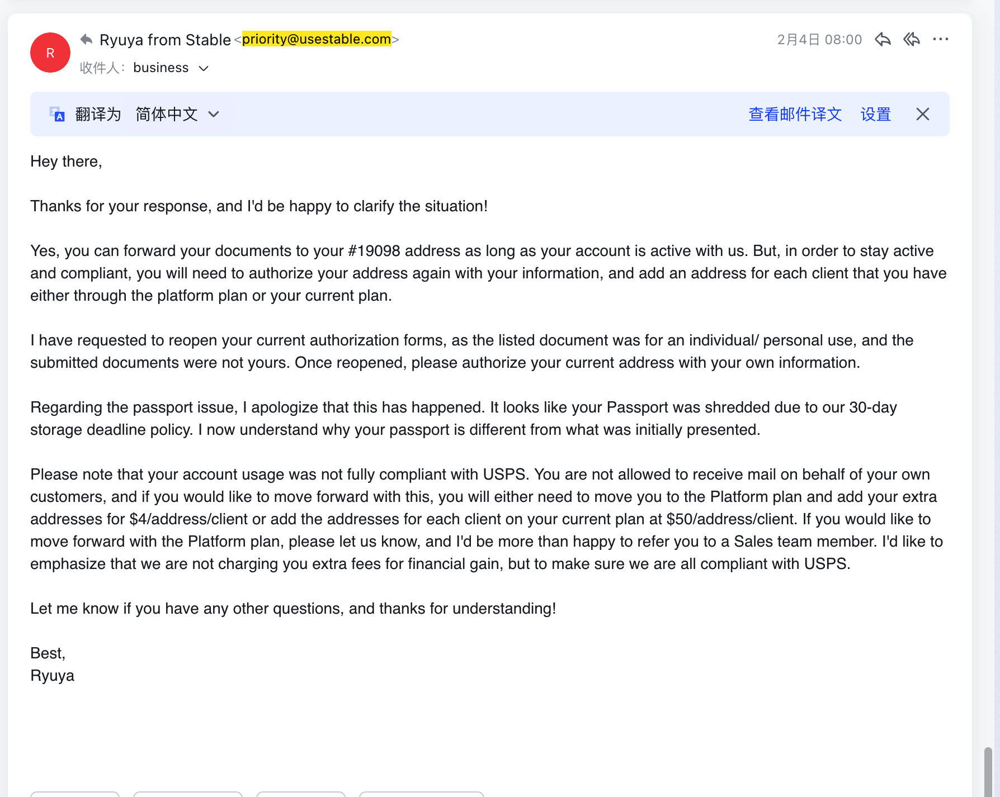
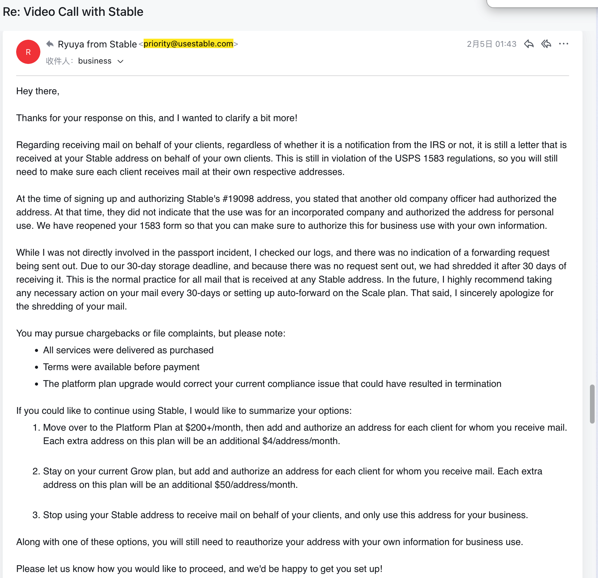

# Stable (www.usestable.com) “Unlimited Recipients” and the $200/month Upgrade Ultimatum

> This article describes my experience with Stable / useStable / www.usestable.com pricing, recipient limits, forced upgrade pressure, and the feeling of being trapped after my business address was already tied to important systems.

I did not choose Stable simply because it was cheap or because the website looked modern. For a non-U.S. founder operating U.S. companies, a Stable virtual address is not decoration. It goes into IRS records, bank accounts, payment platforms, customer profiles, vendor systems, and company documents.

Once a Stable address is used, leaving is not as simple as cancelling a normal SaaS subscription.

When I saw Stable pricing pages and help center language about “unlimited recipients,” I understood that Stable virtual address service could support real business mail operations with different names, companies, and projects.

I did not expect “unlimited” to later become the reason Stable would pressure me into a much more expensive plan.

## The Feeling Was Not a Friendly Upgrade

What I felt later was not a normal plan recommendation. It felt like pressure after lock-in.

My tax records, banks, customers, and business systems already used the Stable address. Then Stable / useStable told me that my usage was not acceptable and that I needed to upgrade to a more expensive plan. My understanding was that the cost would rise from a much lower monthly plan to around $200/month, with possible additional recipient-based fees.

At that moment, I was not choosing freely from a pricing page. I was already inside their system.

What I heard was not “we have a better plan for you.” It felt more like: if you do not pay more, your account may be closed and your future mail may stop.

That is the part that matters. A normal SaaS price increase can be rejected. But a virtual address provider knows the user is already tied to the address. If the address is cut off, IRS mail, bank mail, customer mail, and government documents may be interrupted.

Stable did not give me the safety I needed. I did not receive a real transition plan. I did not hear that I could take one or two months to move the address. I did not hear that mail in transit could be forwarded for a fee. I did not hear: “We understand you are already tied to this address, and we will give you time.”

What I felt was simple: pay more or lose the account.

## Pricing Promises Became Different Rules

If Stable believes “unlimited recipients” has a reasonable-use boundary, that boundary should be visible before purchase. Users should know how many legal entities, projects, DBA names, or recipient names are allowed before buying Stable virtual mailbox service.

The user should not learn the real rule only after the address has already been used across tax, banking, and business systems.

I also experienced confusion around scanning features. My understanding from Stable pricing or product language was that certain scanning features were included, but I was later told that higher plans or additional fees were required.

## It Was Not Just About $200

The $200/month number matters, but the deeper issue is power.

If I had not yet used the Stable address, I could walk away. But after IRS, banks, payment platforms, and customers already had the Stable address, I was no longer deciding whether to buy a product. I was deciding whether my company’s communication channel would be cut off.

That is why the upgrade pressure felt coercive. It was not a friendly reminder. It was not a conversation. It was the feeling of being pushed against a wall: pay or be cut off.

## “Unlimited” Should Not Only Work in Marketing

If “unlimited recipients” has limits, Stable / useStable / www.usestable.com should state them clearly before the customer buys.

Otherwise, “unlimited” becomes a marketing word when Stable wants the customer, and a platform-controlled word when Stable wants more money or wants to close the account.

For me, this was not an ordinary business disagreement. It was a small user being pressed by platform rules after the platform already controlled the address, the mail access, and the continuity of the business.

