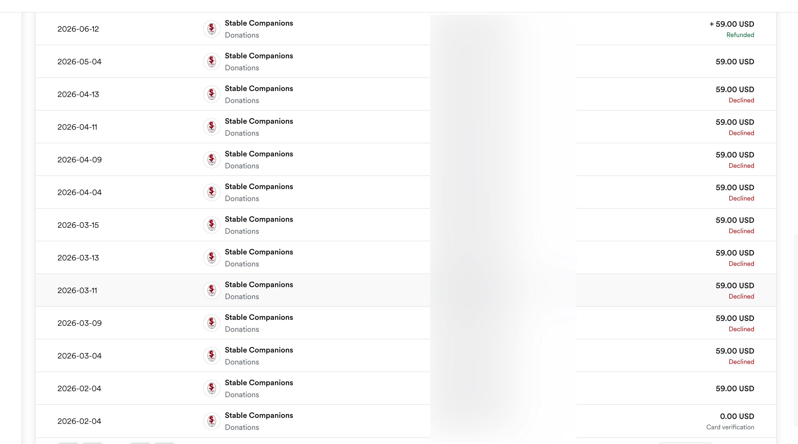
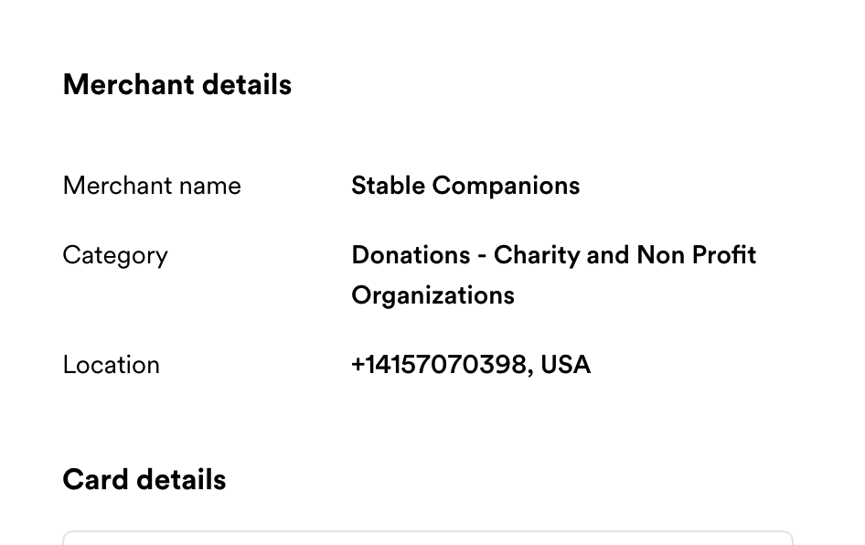
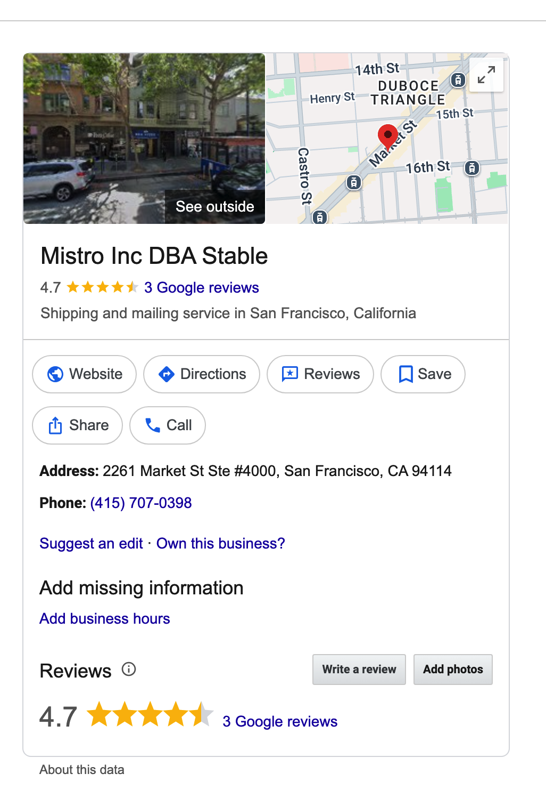

# Stable (www.usestable.com) Billing Showed “Donations”: Why I Asked Who Took the Money

> This article documents my billing question about Stable / useStable / www.usestable.com. I paid for Stable business address and virtual mailbox services, not a donation. So why did the billing descriptor appear similar to “Stable Companions Donations”?

This started when my company was reviewing accounting records.

My accountant and I saw a transaction that appeared similar to **Stable Companions Donations**. That confused me. I bought Stable address / mailbox services from www.usestable.com. I did not donate to an organization called Stable Companions.

For a company, this is not a small display issue. Service fees and donations are not the same thing. A bank seeing a strange merchant descriptor or the word “donations” may trigger payment failure, fraud review, or card locking.

This may also have contributed to later payment failure: we did not even know that the charge was related to Stable. The card or bank did not see a clear Stable service bill. It saw a confusing donation-like descriptor.

## I Asked Stable for an Explanation

I asked Stable / useStable why a payment for www.usestable.com services appeared under this kind of merchant name. Was it Stable’s payment processor? Was it an internal merchant account? Was it a different entity?

This is a basic accounting question. A business needs to know who was paid and how to classify the expense.

I did not receive a clear explanation.

## I Later Found a Nonprofit Website

Here is the billing screenshot showing the confusing descriptor:

I searched the merchant name and found a related nonprofit website:

<https://www.stablecompanionscharity.org/>

I am not claiming, without evidence, that the website and Stable / useStable / www.usestable.com are necessarily connected. But as the paying customer, I have the right to ask why a commercial Stable virtual address / mailbox fee appeared with a donation-like billing descriptor.

Users should not have to investigate merchant names like detectives to understand their own subscription charges.

## Why This Matters

Accounting needs to know whether a payment is a service fee, subscription, processing fee, or donation. Banks may flag unfamiliar merchant names. Users may mistake the charge for fraud. Later refunds, disputes, or tax reviews may all depend on the billing descriptor.

I paid for Stable virtual address and Stable mailbox services. I should not have to guess whether the descriptor is related to Stable, whether it affects accounting classification, or whether it caused bank risk controls.

I want Stable / useStable / www.usestable.com to explain the true receiving entity, why the word “Donations” appeared, whether any nonprofit, payment processor, or internal merchant account was involved, and whether Stable can provide a proper invoice showing this was a service fee.

